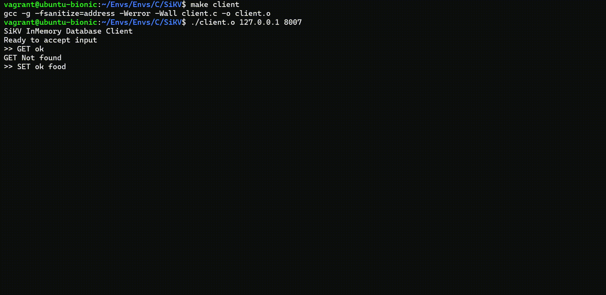

# SiKV
In memory Key Value store

Currently supports single threaded client-server communication. The underlying hashmap is not thread safe -- this will be changed later

Tested on my laptop installed with AMD Ryzen 7 5700U processor running the following software in a VM
```
Ubuntu 20.04.6 LTS
Linux 5.4.0-182-generic
GCC v9.4.0
```

# Installing Dependencies
To install all requirements[Tested on Ubuntu]:
```
sudo chmod +x install_dependencies_ubuntu.sh
./install_dependencies_ubuntu.sh
```

To use the custom allocator. You need to pass the `USE_CUSTOM_ALLOC=yes` flag like this `make USE_CUSTOM_ALLOC=yes`. Check the documentation for [liballoc](https://github.com/misachi/allocator) on how to install it.

You may need to add `/usr/local/lib` to your linker path with `ldconfig` command -- This might require user with `sudo` privileges. 

# Examples

## Running the server
Remember to replace `main.o` with `main.out`


## Running the client
Remember to replace `client.o` with `client.out`




### Check for potential memory leaks
**NOTE**: This will not run when using custom allocator(i.e USE_CUSTOM_ALLOC is set to value > 0) since Valgrind does not work well with `mmap`

```
make memcheck  # server
make client_memcheck  # client
```
